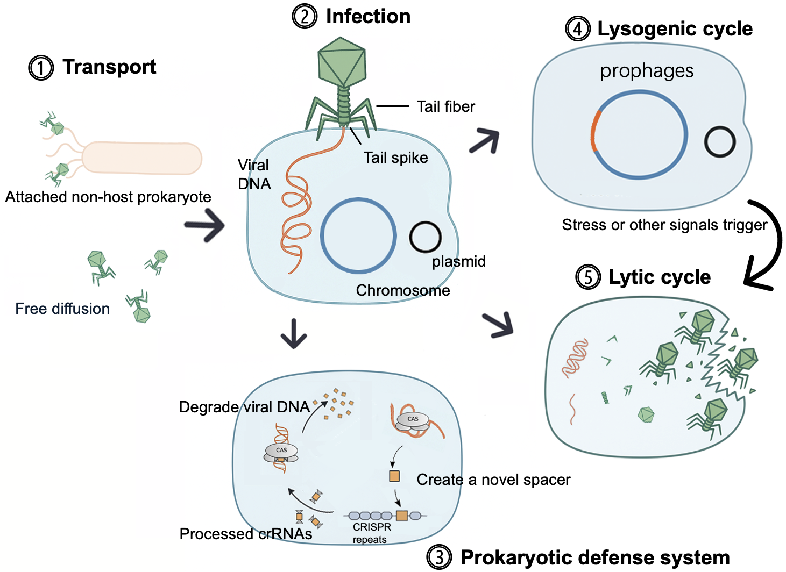

# Computational approaches for virus-host prediction: A review of methods and applications

By providing a rigorous, comparative analysis, this review serves two critical functions. First, it acts as a practical guide for researchers selecting the optimal tool for their work. Second, it establishes a foundational resource and a new performance benchmark intended to drive the next wave of innovation in deciphering the complex web of virus-host interactions.

Our key contributions are:

\begin{itemize}
    \item \textbf{A standardized problem formulation:} We establish a structured framework for the virus-host prediction problem, providing a consistent foundation for understanding and comparing diverse computational strategies.
    \vspace{-0.1cm}
    \item \textbf{A comprehensive survey of tools and biological features:} We critically evaluate 27 existing tools, analyzing their methodologies, strengths, and weaknesses. We then survey the full spectrum of biological features they employed, from CRISPR spacer matching and prophage detection to alignment-free $k$-mer frequency analysis.
    \vspace{-0.1cm}
    \item \textbf{Rigorous benchmarking using carefully designed datasets:} Another key novelty is the development and application of two distinct evaluation benchmarks. \textbf{RefSeq-VHDB} provides a curated set of phage-host pairs for standardized assessment, while \textbf{MetaHiC-VHDB} consists of three independent metagenomic Hi-C test sets designed to assess tool performance in realistic ecological contexts. These benchmarks provide a practical guide for researchers and expose performance gaps that future methods must address.
\end{itemize}

## Instructions

This repository store the results reported in the paper. There are four main folder:

* Data: The raw data used in the experiments, including sequences and CSV files
* Benchmark: The scripts/commands to run the host prediction tools and their outputs. We also provide a NoteBook to generate the results reported in the paper.
* FeatureExploration: The intermidiate files for analyze biological features. We also provide a NoteBook to generate the results reported in the paper.
* Figures: The figures used in the paper.

Detiled information can be found via the README in each folder.

### Contacts and bug reports
Please feel free to send bug reports or questions to us. You can post an issue or directly email me (jiayushang@cuhk.edu.hk).